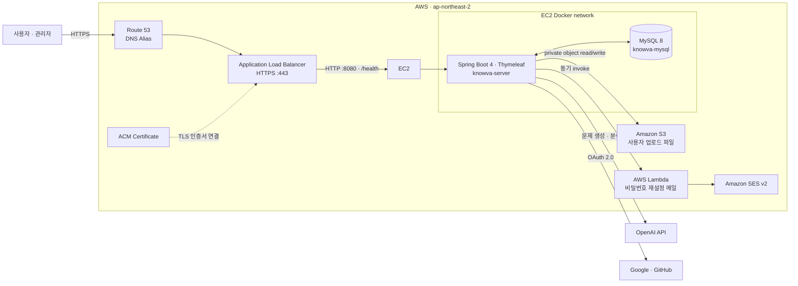
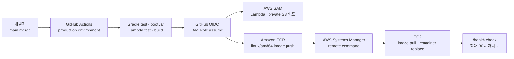

# Knowva

코딩 입문자를 위한 웹 학습 플랫폼입니다.

[포트폴리오 홈](https://github.com/jeonggul) · [팀 저장소](https://github.com/hyunkyumlee/Acorn-E-Learning)

## 프로젝트 개요

**기간:** 2026.06.17–2026.07.27  
**구성:** 7인 팀 프로젝트

코딩 입문자가 이론 학습, 문제풀이, 오답 복습과 커뮤니티 기록을 이어갈 수 있는 웹 학습 플랫폼입니다. 저는 웰컴 튜토리얼부터 회원가입·로그인, 비밀번호 재설정까지 사용자의 서비스 진입 흐름을 구현하고, 인증·보안·세션 관리를 담당했습니다.


이메일 로그인, Google·GitHub 로그인과 회원가입·비밀번호 찾기 진입 화면입니다.

## 담당 범위

인증·세션 담당으로 회원가입, 일반 로그인, Google·GitHub OAuth, 로그인 상태 재검증, 자동 로그인, 이메일 기반 비밀번호 재설정과 웰컴 튜토리얼을 구현했습니다.

아래 내용은 팀 서비스 중 제가 담당한 인증·세션과 온보딩 기능입니다.

## 사용 기술

Java 17 · Spring Boot 4.0.6 · Spring MVC · MyBatis · MySQL · Thymeleaf  
HttpSession · BCrypt · OAuth · Java Mail · JUnit · Git/GitHub

## 소셜 로그인과 추가 회원가입 흐름 분리

Google·GitHub 인증을 마친 뒤 추가 정보 입력 중에 이탈하면 불완전한 계정이 남을 수 있어, 소셜 인증과 회원 생성을 분리했습니다. 처음 로그인한 사용자의 인증 정보는 세션에 임시 보관하고, 닉네임과 관심 과목 입력을 마친 뒤 계정과 관련 데이터를 하나의 트랜잭션으로 저장했습니다. 이미 연동된 계정은 바로 로그인하도록 분기하고, 인증 요청 때 저장한 state를 콜백에서 대조해 요청의 일치 여부를 확인했습니다.

## 자동 로그인과 비밀번호 변경의 연결

자동 로그인 쿠키에는 사용자 식별자, 비밀번호 변경 시각을 바탕으로 한 버전, HMAC 서명을 사용했습니다. 복원 시 서명과 계정 상태, 버전 일치를 확인해 비밀번호 변경 전에 발급된 자동 로그인 쿠키로는 세션이 복원되지 않도록 했습니다.

## 비밀번호 재설정 링크의 재사용 방지

재설정 토큰은 충분한 길이의 난수로 발급하고 DB에는 원문 대신 SHA 256 해시를 저장했습니다. 만료 시각과 사용 여부를 확인하고, 미사용 토큰만 사용 처리할 수 있는 조건부 갱신 결과를 검사했습니다. 토큰 사용 처리와 비밀번호 변경을 같은 트랜잭션으로 묶었습니다.

## 웰컴 튜토리얼

단계별 메시지와 캐릭터 위치 등을 화면 모델로 전달하고, 방문자의 로그인 상태와 역할에 맞게 진입 화면을 연결했습니다.

## 구현 결과

회원가입부터 로그인 유지, 계정 상태 변경 반영, 비밀번호 복구까지 인증 흐름을 연결했습니다. 계정 상태와 토큰 상태를 서버에서 다시 확인하는 지점을 구분하고, 관련 서비스와 인터셉터 테스트를 작성했습니다.
## 담당 코드 살펴보기

- [회원가입과 인증 서비스](ELearning/src/main/java/com/acorn/elearning/auth/service/AuthService.java)
- [OAuth 인증과 가입 분기](ELearning/src/main/java/com/acorn/elearning/auth/service/OAuthService.java)
- [자동 로그인 쿠키](ELearning/src/main/java/com/acorn/elearning/security/RememberMeCookie.java)
- [자동 로그인 복원](ELearning/src/main/java/com/acorn/elearning/security/RememberMeInterceptor.java)

## 팀 프로젝트 전체 문서

아래는 기존 팀 README입니다. 서비스 전체 기능과 운영 환경을 설명하며, 위의 개인 담당 범위와 구분합니다.

<details>
<summary>팀 서비스 소개 · 아키텍처 · 배포 · 기술 문서 펼치기</summary>

<p align="center">
  
</p>

<h1 align="center">Knowva</h1>

<p align="center">
  <strong>학습의 흐름을 설계하고, AI 피드백으로 다음 행동을 제안하는 게이미피케이션 코딩 학습 플랫폼</strong>
</p>

<p align="center">
  <a href="https://knowvaedu.com">서비스 바로가기</a>
  ·
  <a href="https://app.notion.com/p/E-Knowva-37b04ef58e2a803287a3e65d4ec452b9?source=copy_link">기획·산출물</a>
</p>

> 에이콘 E학습터 최종 프로젝트입니다. <br>
> **문제를 푸는 순간**에서 끝나지 않고, 학습 진도·코딩 테스트·AI 분석·커뮤니티를 하나의 학습 루프로 연결합니다.

## ✨ Why Knowva?

초보 학습자는 무엇을 공부할지, 지금 실력이 어느 정도인지, 다음에 무엇을 보완해야 하는지 판단하기 어렵습니다. Knowva는 과목별 커리큘럼을 **행성 탐험형 로드맵**으로 풀어내고, 레슨 완료와 코딩 테스트 결과를 AI 분석 및 복습 행동으로 연결합니다.

| 학습의 단절 | Knowva의 해결 방식 |
| --- | --- |
| 학습 순서가 보이지 않음 | 행성·레슨·난이도로 구성된 시각적 로드맵과 잠금 해제 |
| 풀고 끝나는 코딩 문제 | 실행 테스트, 채점, 오답 복습, 다음 단계 unlock |
| 피드백이 추상적임 | 제출 이력 기반 AI 분석과 강점·보완점·추천 학습 제안 |
| 혼자 학습하기 지루함 | 과목별 커뮤니티, 학습 기록, 반응, 콘텐츠 추천 |

## 🧭 학습 경험

```text
온보딩 · 과목 선택
        ↓
행성형 커리큘럼 → 레슨 학습 → 코딩 테스트
        ↓                         ↓
   출석 · 랭킹 · 북마크      실행 테스트 · 채점
        ↓                         ↓
        └──── AI 학습 분석 · 오답 복습 ────┘
                         ↓
              과목별 커뮤니티 · 콘텐츠 추천
```

## 🖼️ 서비스 화면

<p align="center">
  
  
  
</p>

<p align="center">
  <sub>학습 로드맵 · 레슨 목록 · 코드 에디터 및 실행 테스트</sub>
</p>

## 🚀 핵심 기능

### 1. 개인화된 학습 로드맵

- Java, Python, SQL, HTML/CSS/JS 과목별 커리큘럼을 Bronze · Silver · Gold 난이도와 행성 단위 로드맵으로 제공
- 레슨 완료·레벨 테스트·난이도 unlock 정책을 기준으로 다음 행성과 레슨을 해금
- 누비 출석 도장, 누적 점수, 북마크, 오답 복습, 주간·월간 랭킹으로 학습 지속성을 지원

### 2. AI 코딩 테스트와 실행 환경

- 과목·난이도·현재 학습 범위를 반영해 AI가 코딩 테스트 문제를 생성
- CodeMirror 6 에디터에서 코드 작성 후 실행 테스트의 표준 출력으로 즉시 확인하고, 실행 이력이 있어야 제출 가능
- 사용자 코드와 테스트 케이스를 채점하고, 문제별 제출 상태와 최종 시험 결과를 저장
- AI raw 응답에 정답 로직이 섞여도 학습자·분석 AI에는 공통 TODO starter code만 전달해 평가 공정성을 유지

### 3. AI 학습 분석

- 시험 결과와 풀이 이력을 바탕으로 강점, 보완점, 다음 학습 행동을 분석
- 요청 토큰과 성공 보고서를 기준으로 중복 분석 생성을 막고, 실패한 생성 요청은 재시도 가능하게 관리
- 분석 결과를 대시보드와 오답 복습 흐름으로 연결

### 4. 학습 커뮤니티와 추천 콘텐츠

- 과목·게시판·정렬 필터 기반의 커뮤니티와 Milkdown 기반 Markdown/기본 모드 에디터 제공
- 본문 이미지 첨부, 댓글, 좋아요, 스크랩, 신고와 관리자 moderation 이력으로 운영 가능한 게시판 구성
- 현재 과목에 맞는 동영상·설치 가이드 등 추천 콘텐츠를 연결

- 오답노트를 Markdown 파일로 내려받거나 커뮤니티 게시글 초안으로 이어서 작성 가능

### 5. 계정·결제·권한 관리

- 이메일 로그인, Google·GitHub OAuth, Lambda·SES 기반 비밀번호 재설정 메일 흐름 제공
- 세션 기반 인증과 사용자·관리자 역할 분리, 공통 validation·예외 응답·idempotency 처리 적용
- Kakao Pay와 Toss Payments 기반 프리미엄 결제·권한 부여 흐름 제공

## ⚙️ 운영 아키텍처



- Route 53 alias가 ALB로 요청을 전달하고, ACM 인증서가 연결된 ALB가 HTTPS를 종료한다.
- ALB는 `/health` 상태 검사를 통과한 EC2의 Dockerized Spring Boot 앱으로만 요청을 전달한다. 앱과 MySQL은 같은 Docker network에서 통신한다.
- 업로드 파일은 private S3에 저장하고, 브라우저에는 S3 URL을 직접 노출하지 않는다. 앱의 same-origin endpoint가 권한을 확인한 뒤 streaming한다.
- 비밀번호 재설정은 EC2 앱이 Lambda를 동기 호출하고, Lambda가 SES v2로 메일을 전송한다.

## 🚚 배포 흐름



1. `main` push 또는 수동 실행이 production GitHub Environment의 workflow를 시작한다.
2. Spring Boot test·`bootJar`와 Lambda test·build를 통과한 뒤 GitHub OIDC로 AWS IAM Role을 assume한다. long-lived AWS access key는 저장하지 않는다.
3. SAM이 Lambda와 private S3를 배포하고, Lambda에 invalid request smoke test를 수행한다.
4. Git SHA 태그와 `latest` 태그의 `linux/amd64` Docker image를 ECR에 push한다.
5. SSM이 EC2에서 새 image를 pull하고, S3 모드면 기존 로컬 업로드를 동기화한 뒤 컨테이너를 교체한다.
6. `http://localhost:8080/health`가 최대 30회 안에 성공해야 deployment가 완료된다.

운영은 `MAIL_TRANSPORT=lambda`, `KNOWVA_STORAGE_MODE=s3`로 Lambda·SES와 private S3를 사용한다. 전환·복구를 위해 코드 차원에서는 `smtp|lambda`, `local|mirror|s3` adapter도 유지한다.

## 🧱 Tech Stack

| 구분 | 기술 |
| --- | --- |
| Backend | Java 17, Spring Boot 4.0.6, Spring MVC, Spring Security, Validation, MyBatis |
| View | Thymeleaf, HTML/CSS/JavaScript, CodeMirror 6, Milkdown 7, Marked, DOMPurify, esbuild |
| Data | MySQL 8, MyBatis, H2 test runtime |
| AI · External | OpenAI API, Google OAuth 2.0, GitHub OAuth, Kakao Pay, Toss Payments |
| Infra | Docker, EC2, ALB, Route 53, ACM, ECR, Systems Manager, Lambda, SES v2, private S3, AWS SAM |
| CI/CD | GitHub Actions, GitHub Environment, OIDC IAM Role |
| Test | JUnit 5, Spring Boot Test, MyBatis Test, H2, Gradle |

## 📂 프로젝트 구조

```text
.
├── ELearning/
│   ├── src/main/java/com/acorn/elearning/
│   │   ├── learning/     # 온보딩, 커리큘럼, 레슨, 레벨 테스트
│   │   ├── exam/         # AI 코딩 테스트, 실행, 채점
│   │   ├── analysis/     # AI 학습 분석과 대시보드
│   │   ├── community/    # 게시글, 댓글, 반응, 신고
│   │   ├── practice/     # 문제 풀이와 오답노트
│   │   ├── ranking/      # 점수·주간/월간 랭킹
│   │   ├── content/      # 과목별 추천 콘텐츠
│   │   ├── auth/         # 로그인, OAuth, Lambda 비밀번호 재설정
│   │   ├── payment/      # 프리미엄 결제와 권한 부여
│   │   ├── storage/      # local/mirror/S3 object storage adapter
│   │   └── common/       # API 응답, 예외, AI client, idempotency
│   ├── src/main/resources/
│   │   ├── templates/    # Thymeleaf screens
│   │   ├── static/       # CSS, JavaScript, 서비스 이미지
│   │   └── mappers/      # MyBatis XML mappers
│   ├── src/main/frontend/ # CodeMirror·Milkdown bundle source
│   └── Dockerfile
├── docs/
│   ├── sql/              # DDL, demo setup, curriculum, community seed data
│   └── 최종 문서/         # WBS, 발표 자료 등 최종 산출물
├── mail-lambda/           # Java 17 기반 SES v2 password-reset Lambda
├── infra/aws/template.yaml # Lambda, private S3, EC2 runtime IAM 정책 SAM template
└── .github/workflows/deploy.yml
```

## 🔗 Links

- Service: [knowvaedu.com](https://knowvaedu.com)
- Planning & deliverables: [E Knowva Notion](https://app.notion.com/p/E-Knowva-37b04ef58e2a803287a3e65d4ec452b9?source=copy_link)
- Database documents: [docs/sql](docs/sql)


</details>
